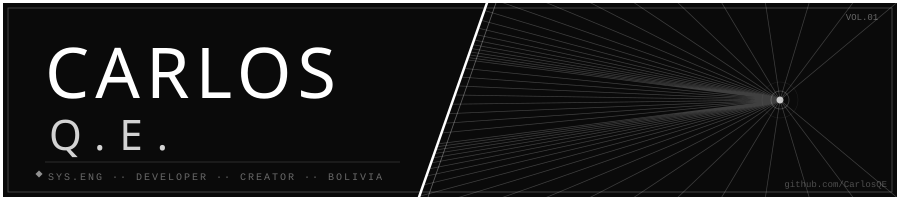

 

<table>
<tr>
<td valign="top" width="55%">
<h3><code>[ 01 ]</code> — ORIGIN</h3>

Estudiante de Ingeniería de Sistemas en Bolivia. Programador autodidacta con stack variado, construyendo soluciones reales: desde blockchain en Go hasta sistemas web corporativos. Apasionado por la historia y cultura de los videojuegos.

<strong>— MISIONES ACTIVAS —</strong>

◾ <strong><a href="https://github.com/CarlosQE">TechVault Coin</a></strong> · Blockchain en Go respaldado por activos NASDAQ-100 
◾ <strong>INSEIN SRL</strong> · Web corporativa para operaciones en minería 
◾ <strong><a href="https://youtube.com/@Bit_exl">Bit_exl</a></strong> · Canal YouTube sobre historia de videojuegos

</td>
<td valign="top" width="45%" align="center">

</td>
</tr>
</table>

`[ 02 ]` — ARSENAL
Languages
      
Herramientas & Plataformas
      

`[ 03 ]` — REGISTROS

&nbsp;&nbsp;

  

`[ 04 ]` — TRANSMISIONES

      

 

<code>◾ systems engineer in training ◾ autodidact ◾ builder ◾ pixel art creator ◾</code>

